<!-- GitHub Profile README -->

<h2 align="center">#!/usr/bin/env welcome</h2>
<h1 align="center">I'm Alex Beigel</h1>
<h3 align="center">🚀 DevOps-Focused Software Engineer 🚀</h3>

  

---

## 🔧 About Me

With a deep-rooted passion for inventing, planning, and building, I bring over **8 years of development experience** and a relentless curiosity for systems thinking and innovation.  

Currently, I focus on combining **programming** and **DevOps**, working daily with:
- 🐧 **Linux**
- 🐍 **Python**
- 🔧 **Bash**
- 🐳 **Docker**
- 🛠️ **CI/CD**
- 🗄️ **Database Integration & Secrets Management**

I thrive in environments that demand **rapid problem solving**, **automation**, and **secure, scalable solutions**.

---

## 🛠️ Tools & Technologies

  
  
  
  
  

  
  
  
  
  

---

## 🚧 What I’m Working On

- Building production-ready, Dockerized apps
- Mastering **CI/CD pipelines** & infrastructure-as-code
- Diving deeper into **Kubernetes**, **Helm**, and **Jenkins**
- Architecting reliable, testable, and secure deployments

---

## 🧠 Learning Philosophy & Mindset

> “Learn fast. Think in systems. Automate everything you can.”  

I believe in combining **strong fundamentals** with **creative problem solving**, and I embrace new tech with speed and confidence. My curiosity and adaptability fuel every challenge I take on.

---

## 📫 Let's Connect

  

---

  
  
  

  

